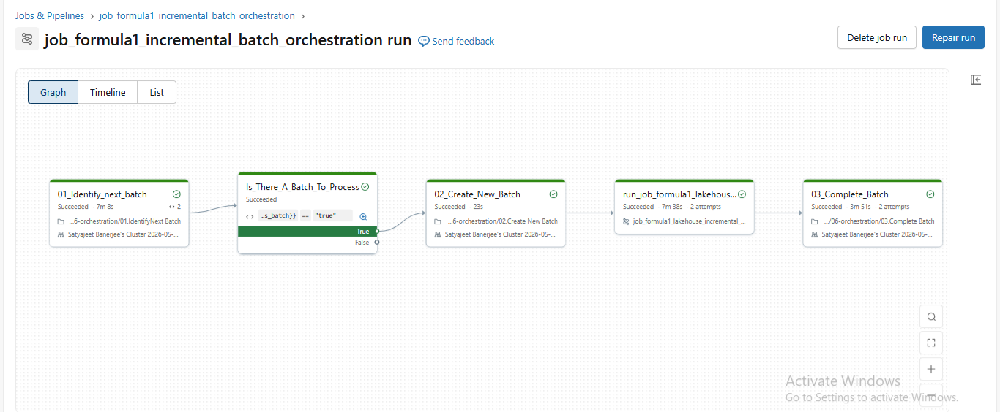
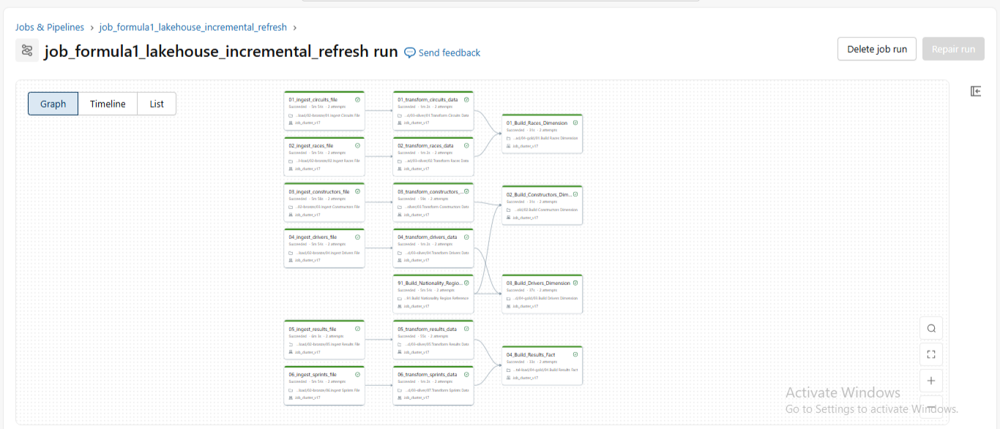

# Formula1 Incremental Lakehouse Data Engineering Project

## Overview

This project is an end-to-end Data Engineering pipeline built using Azure Databricks, PySpark, Delta Lake, Unity Catalog, and Spark SQL.

The pipeline implements a Medallion Architecture (Bronze, Silver, Gold) and supports incremental batch processing using Delta Lake MERGE operations and workflow orchestration.

The solution processes Formula 1 racing data from multiple source datasets and transforms it into analytics-ready dimensional and fact tables for reporting and business insights.

---

## Architecture

Landing → Bronze → Silver → Gold

### Bronze Layer

* Raw data ingestion
* Schema enforcement
* Source metadata tracking
* Batch-based processing

### Silver Layer

* Data cleansing
* Standardized column naming
* Business key validation
* Duplicate removal
* Incremental merge processing

### Gold Layer

* Dimensional modeling
* Fact table generation
* Business KPI calculations
* Analytics-ready datasets

---

## Technologies Used

* Azure Databricks
* PySpark
* Delta Lake
* Unity Catalog
* Spark SQL
* Azure Data Lake Storage Gen2
* Databricks Workflows
* GitHub

---

## Project Structure

formula1-project-incremental-load

├── 00-common

├── 01-setup

├── 02-bronze

├── 03-silver

├── 04-gold

├── 05-analytics

└── 06-orchestration

---

## Key Features

### Incremental Data Processing

* Batch-based ingestion framework
* Control table driven processing
* Delta Lake MERGE operations
* Idempotent pipeline design

### Metadata Tracking

Each record contains:

* ingestion_timestamp
* source_file
* batch_id
* created_timestamp
* updated_timestamp

### Dimensional Modeling

Dimensions:

* dim_races
* dim_drivers
* dim_constructors

Fact:

* fact_session_results

### Analytics Layer

Driver Standings

* Total points
* Wins
* Podiums
* Rankings

Constructor Standings

* Team performance
* Points aggregation
* Season rankings

---

## Workflow Orchestration

The project includes Databricks Workflows for:

1. Batch Identification
2. Batch Creation
3. Bronze Processing
4. Silver Processing
5. Gold Processing
6. Batch Completion

---

## Skills Demonstrated

* Data Engineering
* PySpark Transformations
* Delta Lake
* Incremental ETL Pipelines
* Medallion Architecture
* Data Modeling
* Workflow Orchestration
* Spark SQL
* Azure Databricks
* Unity Catalog

---

## Workflow Orchestration

## Incremental Pipeline

